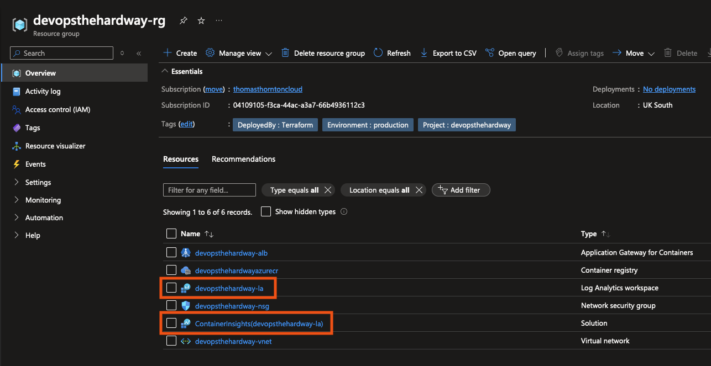

# Create an Azure Log Analytics Workspace

## 🎯 Purpose
In this lab, you'll create a Log Analytics workspace to view container insights of your AKS Cluster.

## 🛠️ Create the Log Analytics Workspace Terraform Configuration

### Prerequisites
- [ ] Basic understanding of Azure Log Analytics

### Steps

1. **Review and Change Terraform .tfvars**
   - Open the [terraform.tfvars](https://github.com/thomast1906/DevOps-The-Hard-Way-Azure/tree/main/Terraform-AZURE-Services-Creation/3-log-analytics/terraform.tfvars) file.
   - Ensure all values are accurate for your environment.

2. **Understand the Terraform Configuration**
   Review the [Log Analytics Terraform configuration](https://github.com/thomast1906/DevOps-The-Hard-Way-Azure/tree/main/Terraform-AZURE-Services-Creation/3-log-analytics). The `la.tf` file will:
   - [ ] Use a Terraform backend to store the `.tfstate` in an Azure Storage Account
   - [ ] Create a Log Analytics workspace using `azurerm_log_analytics_workspace`
   - [ ] Enable the ContainerInsights solution using `azurerm_log_analytics_solution`
   - [ ] Use the `uksouth` region (can change if desired)

3. **Create the Log Analytics Workspace**
   Run the following commands in your terminal:
   ```bash
   terraform init
   terraform plan
   terraform apply
   ```

## 🔍 Verification
To ensure the resources were created successfully:
1. Log into the [Azure Portal](https://portal.azure.com)
2. Navigate to the Resource Group
3. Verify the presence of the Log Analytics workspace and ContainerInsights solution:

Example screenshot of created resources:



## 🧠 Knowledge Check

After creating the Log Analytics workspace, consider these questions:
1. Why is Log Analytics important for managing AKS clusters?
2. How does the ContainerInsights solution enhance your ability to monitor AKS?
3. What types of insights can you gain from Log Analytics in an AKS context?

## 💡 Pro Tip

Consider setting up [custom dashboards](https://azure.microsoft.com/en-gb/free/search/?ef_id=_k_Cj0KCQjwr9m3BhDHARIsANut04aW1Bkx-AcJ5QGbPg_zxVIQw_txn1OWbyl-KpP1uzi0WxsLeZHjZDEaAmGcEALw_wcB_k_&OCID=AIDcmm3bvqzxp1_SEM__k_Cj0KCQjwr9m3BhDHARIsANut04aW1Bkx-AcJ5QGbPg_zxVIQw_txn1OWbyl-KpP1uzi0WxsLeZHjZDEaAmGcEALw_wcB_k_&gad_source=1&gclid=Cj0KCQjwr9m3BhDHARIsANut04aW1Bkx-AcJ5QGbPg_zxVIQw_txn1OWbyl-KpP1uzi0WxsLeZHjZDEaAmGcEALw_wcB) in Azure Portal using the data collected by Log Analytics to get quick insights into your AKS cluster's performance and health.
